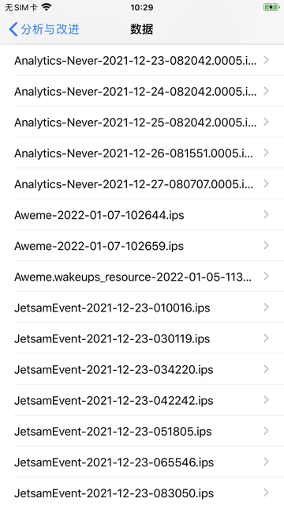
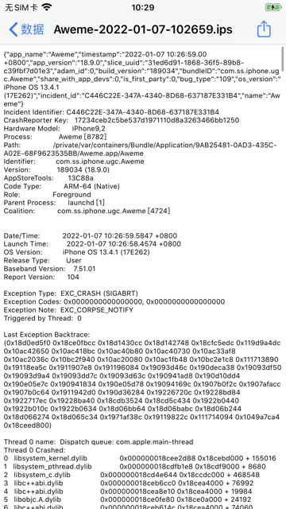
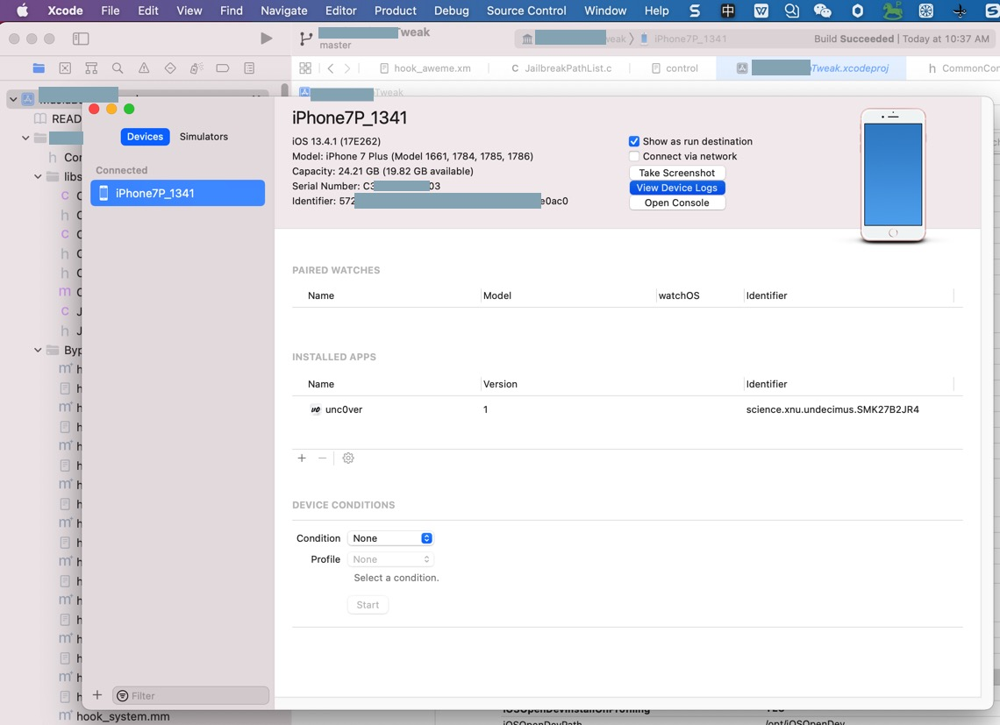
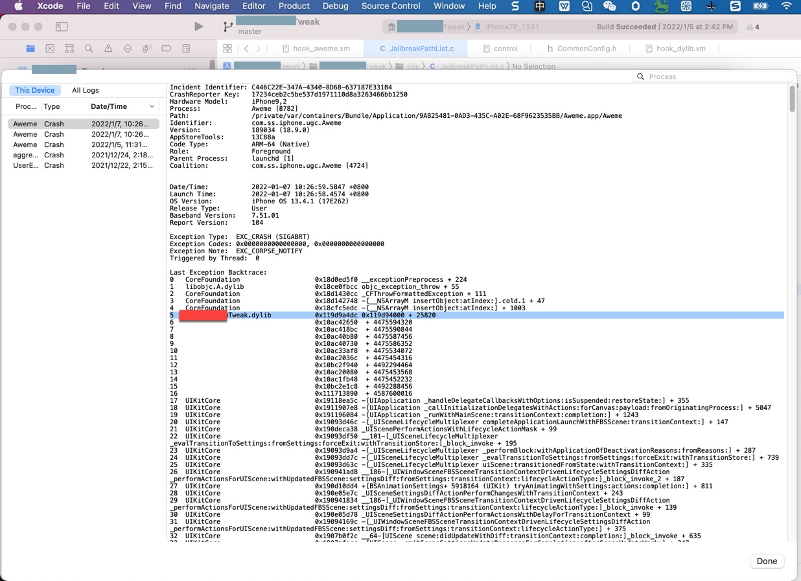
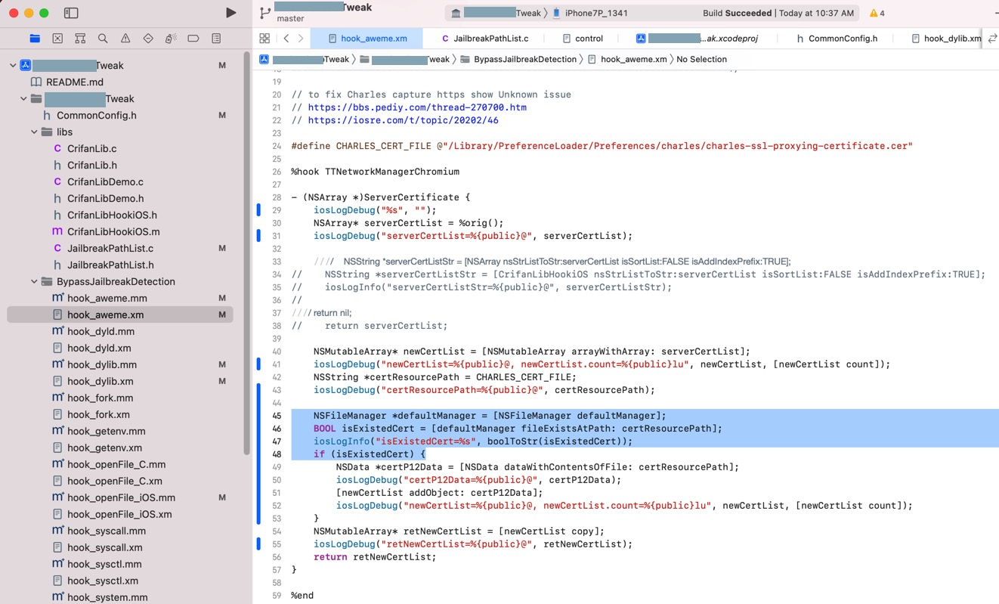

# app启动后崩溃

* 现象：用frida-ios-dump砸壳后的app，启动后就崩溃
* 原因
  * 其实有多种可能
* 思路
  * 可以通过找app崩溃日志，而找到，具体错误的现象和找出背后的根本原因

### 通过ips崩溃日志找崩溃原因

举例：

抖音启动就闪退崩溃，此时去找crash崩溃日志：



打开对应的，Aweme的崩溃日志文件：

* `Aweme-2022-01-07-102659.ips`
  * 

```log
{"app_name":"Aweme","timestamp":"2022-01-07 10:26:59.00 +0800","app_version":"18.9.0","slice_uuid":"31ed6d91-1868-36f5-89b8-c39fbf7d01e3","adam_id":0,"build_version":"189034","bundleID":"com.ss.iphone.ugc.Aweme","share_with_app_devs":0,"is_first_party":0,"bug_type":"109","os_version":"iPhone OS 13.4.1 (17E262)","incident_id":"C446C22E-347A-4340-8D68-637187E331B4","name":"Aweme"}
Incident Identifier: C446C22E-347A-4340-8D68-637187E331B4
CrashReporter Key:   17234ceb2c5be537d1971110d8a3263466bb1250
Hardware Model:      iPhone9,2
Process:             Aweme [8782]
Path:                /private/var/containers/Bundle/Application/9AB25481-0AD3-435C-A02E-68F9623535BB/Aweme.app/Aweme
Identifier:          com.ss.iphone.ugc.Aweme
Version:             189034 (18.9.0)
AppStoreTools:       13C88a
Code Type:           ARM-64 (Native)
Role:                Foreground
Parent Process:      launchd [1]
Coalition:           com.ss.iphone.ugc.Aweme [4724]

Date/Time:           2022-01-07 10:26:59.5847 +0800
Launch Time:         2022-01-07 10:26:58.4574 +0800
OS Version:          iPhone OS 13.4.1 (17E262)
Release Type:        User
Baseband Version:    7.51.01
Report Version:      104

Exception Type:  EXC_CRASH (SIGABRT)
Exception Codes: 0x0000000000000000, 0x0000000000000000
Exception Note:  EXC_CORPSE_NOTIFY
Triggered by Thread:  0

Last Exception Backtrace:
(0x18d0ed5f0 0x18ce0fbcc 0x18d1430cc 0x18d142748 0x18cfc5edc 0x119d9a4dc 0x10ac42650 0x10ac418bc 0x10ac40b80 0x10ac40730 0x10ac33af8 0x10ac2036c 0x10bc2f940 0x10ac20080 0x10ac1fb48 0x10bc2e1c8 0x111713890 0x19118ea5c 0x1911907e8 0x191196084 0x19093d46c 0x190deca38 0x19093df50 0x19093d9a4 0x19093dd7c 0x19093d63c 0x190941ad8 0x190d10dd4 0x190e05e7c 0x190941834 0x190e05d78 0x19094169c 0x1907b0f2c 0x1907afacc 0x1907b0c64 0x1911942d0 0x190d36284 0x19226720c 0x19228bd84 0x1922717ec 0x19228ba40 0x18cdb3524 0x18cd5c434 0x1922b0440 0x1922b010c 0x1922b0634 0x18d06bb64 0x18d06babc 0x18d06b244 0x18d066274 0x18d065c34 0x1971af38c 0x19119822c 0x111714094 0x1049a7ca4 0x18ceed800)

Thread 0 name:  Dispatch queue: com.apple.main-thread
Thread 0 Crashed:
0   libsystem_kernel.dylib            0x000000018cee2d88 0x18cebd000 + 155016
1   libsystem_pthread.dylib           0x000000018cdfb1e8 0x18cdf9000 + 8680
2   libsystem_c.dylib                 0x000000018cd4e644 0x18ccdc000 + 468548
3   libc++abi.dylib                   0x000000018ceb6cc0 0x18cea4000 + 76992
4   libc++abi.dylib                   0x000000018cea8e10 0x18cea4000 + 19984
5   libobjc.A.dylib                   0x000000018ce0fe80 0x18ce0a000 + 24192
6   libc++abi.dylib                   0x000000018ceb614c 0x18cea4000 + 74060
7   libc++abi.dylib                   0x000000018ceb60e4 0x18cea4000 + 73956
8   libdispatch.dylib                 0x000000018cdb3538 0x18cd58000 + 374072
9   libdispatch.dylib                 0x000000018cd5c434 0x18cd58000 + 17460
10  FrontBoardServices                0x00000001922b0440 0x19225b000 + 349248
11  FrontBoardServices                0x00000001922b010c 0x19225b000 + 348428
12  FrontBoardServices                0x00000001922b0634 0x19225b000 + 349748
13  CoreFoundation                    0x000000018d06bb64 0x18cfc3000 + 691044
14  CoreFoundation                    0x000000018d06babc 0x18cfc3000 + 690876
15  CoreFoundation                    0x000000018d06b244 0x18cfc3000 + 688708
16  CoreFoundation                    0x000000018d066274 0x18cfc3000 + 668276
17  CoreFoundation                    0x000000018d065c34 0x18cfc3000 + 666676
18  GraphicsServices                  0x00000001971af38c 0x1971ac000 + 13196
19  UIKitCore                         0x000000019119822c 0x19076c000 + 10666540
20  ???                               0x0000000111714094 0 + 4587602068
21  Aweme                             0x00000001049a7ca4 0x1049a0000 + 31908
22  libdyld.dylib                     0x000000018ceed800 0x18ceec000 + 6144


Thread 1:
0   libsystem_pthread.dylib           0x000000018ce07738 0x18cdf9000 + 59192

...
```

从中可以看出：

* 二进制文件：
  * `/private/var/containers/Bundle/Application/9AB25481-0AD3-435C-A02E-68F9623535BB/Aweme.app/Aweme`


注：多次尝试用：

* XCode->Window->Devices and Simulators-》View Devices logs
  * 

最后才看到，解析后的日志，带库（但仍没有解析出函数名）的：

* 

总之，确定是自己的插件导致的了。

重新安装一下反越狱检测插件试试

即可解决问题：

抖音可以正常启动了：

* 

反推：

此处crash是由于之前的代码，hook了https的SSL证书，但是新iPhone测试机中没有Charles证书，导致的崩溃。

之前另外一个iPhone测试机已解决了，但是此处iPhone没安装新版插件。

重新安装修复后的版本：

* 

即可解决问题。
