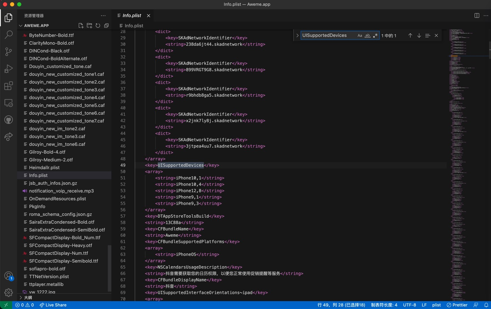

# DeviceNotSupportedByThinning

* 现象：此处把砸壳后的抖音ipa去安装到越狱iPhone中报错：`DeviceNotSupportedByThinning`
  * 
* 原因：
  * 此处的（抖音的app的）ipa是，Thinning瘦身后的
  * 即：上传到AppStore后的，只支持部分iPhone机型的安装包
  * 其中所支持的设备，不包含当前iPhone机型
  * 具体细节
    * `Aweme抖音/已脱壳/Payload/Aweme.app/Info.plist`
      * 
* 解决办法：
  * 方法1：把当前机型，加到其支持列表中
  * 方法2：直接去掉机型限制

* 具体步骤

### 方法1

* 方法1：

解压`ipa`，得到`Payload`目录，找到：

`Payload/xxx.app/Info.plist`

比如此处的：

`Aweme抖音/已脱壳/Payload/Aweme.app/Info.plist`

编辑：`UISupportedDevices`部分，加上自己的机型

此处最后是：

```xml
  <key>UISupportedDevices</key>
  <array>
      <string>iPhone9,1</string>
      <string>iPhone9,2</string>
      <string>iPhone9,3</string>
      <string>iPhone9,4</string>
      <string>iPhone10,1</string>
      <string>iPhone10,2</string>
      <string>iPhone10,3</string>
      <string>iPhone10,4</string>
      <string>iPhone10,5</string>
      <string>iPhone10,6</string>
      <string>iPhone11,2</string>
      <string>iPhone11,4</string>
      <string>iPhone11,6</string>
      <string>iPhone11,8</string>
      <string>iPhone12,1</string>
      <string>iPhone12,3</string>
      <string>iPhone12,5</string>
      <string>iPhone12,8</string>
      <string>iPhone13,1</string>
      <string>iPhone13,2</string>
      <string>iPhone13,3</string>
      <string>iPhone13,4</string>
      <string>iPhone14,2</string>
      <string>iPhone14,3</string>
      <string>iPhone14,4</string>
      <string>iPhone14,5</string>
  </array>
```

注：

自己的机型，可以去参考：

[Models - The iPhone Wiki](https://www.theiphonewiki.com/wiki/Models)

比如：

`iPhone7P`是`iPhone9,2` （另外：美版是`iPhone9,4`）

### 方法2

* 方法2：
  * 直接把`Info.plist`中的`UISupportedDevices`的部分，去掉。
    * 注：未验证是否有效，估计是有效的。
