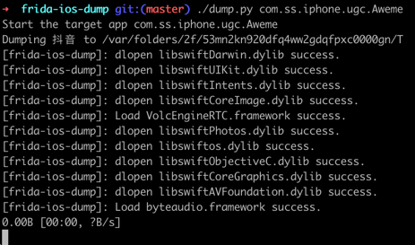

# 无进度：Load success 0.00B [00:00, ?B/s]

* 现象：frida-ios-dump砸壳最后，虽然提示Load success，但是始终没有进度，进度是0
  ```bash
  ./dump.py com.ss.iphone.ugc.Aweme
  Start the target app com.ss.iphone.ugc.Aweme
  Dumping 抖音 to /var/folders/2f/53mn2kn920dfq4ww2gdqfpxc0000gn/T
  。。。
  [frida-ios-dump]: Load byteaudio.framework success.
  0.00B [00:00, ?B/s]
  ```
  * 

* 原因：未知。
* 解决办法：多试几次。
  * **想办法，用各种方式的，多试几次**
    * 包括
      * 故意中断
      * 砸壳前，已启动app，或，不启动app
      * 等等
* 具体步骤：
  * 此处就是，某一次，在用：
    * `./dump.py com.ss.iphone.ugc.Aweme`
  * 启动后，也是同样卡死时
    * 注：当时抖音已正在运行了
  * Ctrl+C中断后，立刻再试：
    * `./dump.py com.ss.iphone.ugc.Aweme`
  * 结果就真的可以继续了。
