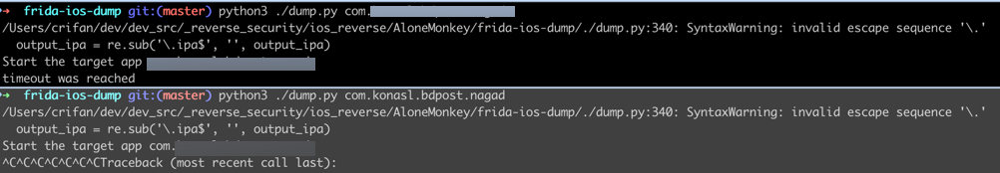

# timeout was reached

## 现象

有时候，运行`./dump.py xxx`时，卡死在：`Start the target app xxx`，过了会，报错：超时了

```bash
➜  frida-ios-dump git:(master) python3 ./dump.py com.xxx.yyy.zzz
/Users/crifan/dev/dev_src/_reverse_security/ios_reverse/AloneMonkey/frida-ios-dump/./dump.py:340: SyntaxWarning: invalid escape sequence '\.'
  output_ipa = re.sub('\.ipa$', '', output_ipa)
Start the target app com.xxx.yyy.zzz
timeout was reached
```



## 原因

* 表面原因：（脚本）无法（自动的去）启动app
* 深层原因：未知

## 解决办法

手动去先（点击桌面图标的方式去）启动app后，再重试，即可继续砸壳出ipa
