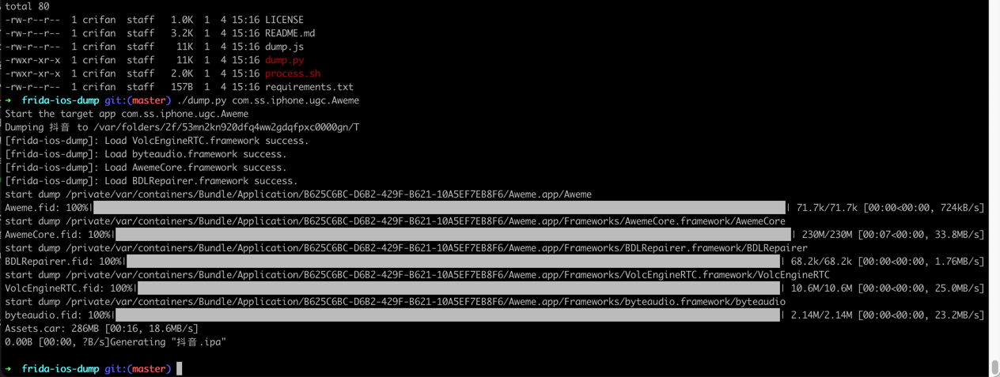
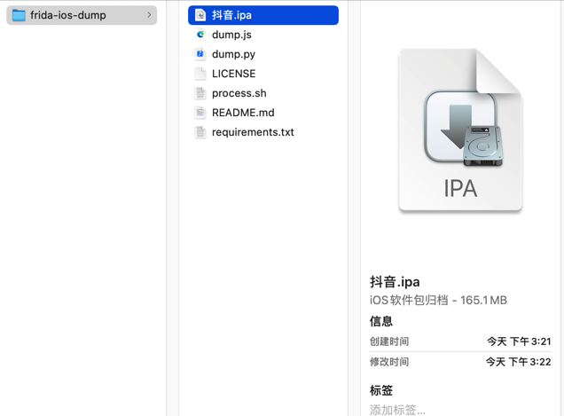

# 抖音的ipa

此处介绍，具体如何用`frida-ios-dump`去砸壳`抖音`的ipa文件：

* 概述
  ```bash
  ./dump.py com.ss.iphone.ugc.Aweme
  ```

## 详解

砸壳的具体过程和详细输出：

```bash
➜  frida-ios-dump git:(master) ./dump.py com.ss.iphone.ugc.Aweme
Start the target app com.ss.iphone.ugc.Aweme
Dumping 抖音 to /var/folders/2f/53mn2kn920dfq4ww2gdqfpxc0000gn/T
[frida-ios-dump]: Load VolcEngineRTC.framework success.
[frida-ios-dump]: Load byteaudio.framework success.
[frida-ios-dump]: Load AwemeCore.framework success.
[frida-ios-dump]: Load BDLRepairer.framework success.
start dump /private/var/containers/Bundle/Application/B625C6BC-D6B2-429F-B621-10A5EF7EB8F6/Aweme.app/Aweme
Aweme.fid: 100%|█████████████████████████████████████████████████████████████████████████████████████████████████████████████████████████████| 71.7k/71.7k [00:00<00:00, 724kB/s]
start dump /private/var/containers/Bundle/Application/B625C6BC-D6B2-429F-B621-10A5EF7EB8F6/Aweme.app/Frameworks/AwemeCore.framework/AwemeCore
AwemeCore.fid: 100%|██████████████████████████████████████████████████████████████████████████████████████████████████████████████████████████| 230M/230M [00:07<00:00, 33.8MB/s]
start dump /private/var/containers/Bundle/Application/B625C6BC-D6B2-429F-B621-10A5EF7EB8F6/Aweme.app/Frameworks/BDLRepairer.framework/BDLRepairer
BDLRepairer.fid: 100%|██████████████████████████████████████████████████████████████████████████████████████████████████████████████████████| 68.2k/68.2k [00:00<00:00, 1.76MB/s]
start dump /private/var/containers/Bundle/Application/B625C6BC-D6B2-429F-B621-10A5EF7EB8F6/Aweme.app/Frameworks/VolcEngineRTC.framework/VolcEngineRTC
VolcEngineRTC.fid: 100%|████████████████████████████████████████████████████████████████████████████████████████████████████████████████████| 10.6M/10.6M [00:00<00:00, 25.0MB/s]
start dump /private/var/containers/Bundle/Application/B625C6BC-D6B2-429F-B621-10A5EF7EB8F6/Aweme.app/Frameworks/byteaudio.framework/byteaudio
byteaudio.fid: 100%|████████████████████████████████████████████████████████████████████████████████████████████████████████████████████████| 2.14M/2.14M [00:00<00:00, 23.2MB/s]
Assets.car: 286MB [00:16, 18.6MB/s]
0.00B [00:00, ?B/s]Generating "抖音.ipa"
```



砸壳出的ipa文件：`抖音.ipa`


