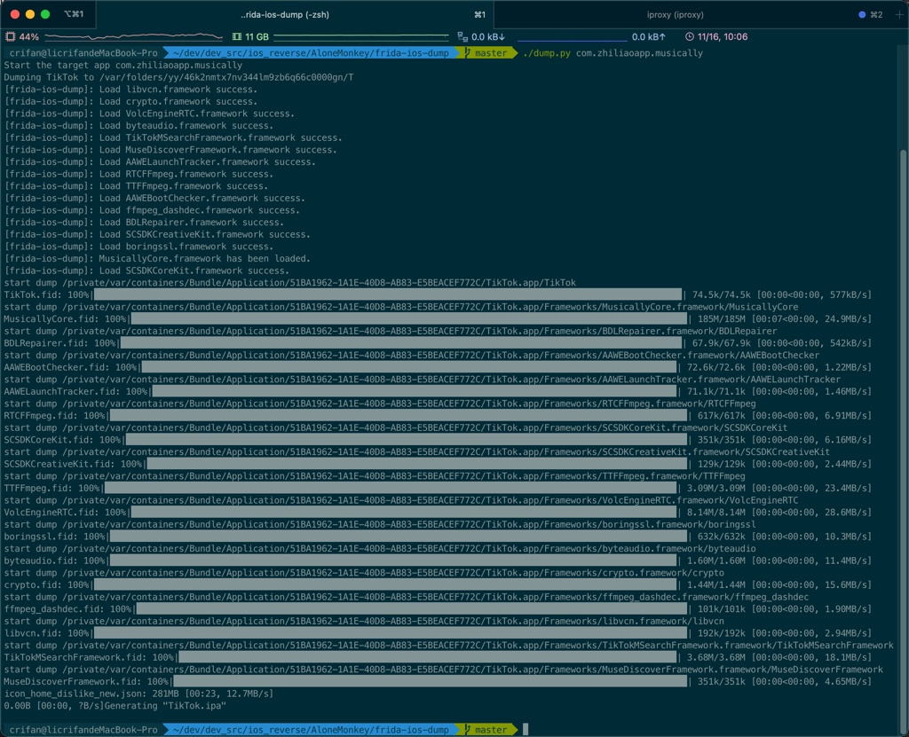

# TikTok的ipa

TODO：

* 【已解决】用frida-ios-dump砸壳报错：Failed to enumerate applications unable to communicate with remote frida-server
* 【已解决】iPhone中Cydia中安装升级最新版的16.0.2的Frida
* 【已解决】frida-ios-dump砸壳报错：ModuleNotFoundError No module named frida

---

给TikTok砸壳出ipa：

## 前提

* 前提：越狱iPhone中已安装`TikTok`
  * 注：通过境外比如美区`AppleID`登录后的`AppStore`中才能搜索和下载`TikTok`

## 砸壳ipa的步骤

（1）先确认app包名

```bash
ideviceinstaller -l -o list_user
```

输出能看到：

* `com.zhiliaoapp.musically, "268010", "TikTok"`

得到`TikTok`包名是：`com.zhiliaoapp.musically`

（2）确保Mac中当前Python中已安装frida（以及相关的库）

如果没有装，要去安装：

```bash
pip install frida paramiko scp tqdm
```

（3）另外新建一个终端，开启端口映射

新建一个终端窗口（或Tab），去运行端口映射

```bash
iproxy 2222 22
```

（4）确保frida版本一致：Mac中和iPhone中frida版本是一样的

说明：

* 如何查看frida版本
  * iPhone
    ```bash
    frida-server --version
    ```
  * Mac
    ```bash
    pip show frida
    ```
* 如果frida版本不一致
  * 后续会报错：`Failed to enumerate applications unable to communicate with remote frida-server`
  * 需要去确保一致
    * 举例：
      * 此处frida版本：
        * Mac：`16.0.2`
        * iPhone：`15.1.27`
      * 如何解决
        * 去iPhone中`Cydia`中升级frida到最新版16.0.2

（5）确保被砸壳的app已退出，没在运行

可选？ iPhone中被砸壳的app，已退出，不要已启动真正运行

（6）真正开始砸壳

```bash
cd /Users/crifan/dev/dev_src/ios_reverse/AloneMonkey/frida-ios-dump
./dump.py com.zhiliaoapp.musically
```



成功的话，有相关日志输出：`Generating "TikTok.ipa"`

即可在当前目录找到砸壳后的ipa文件：`TikTok.ipa`


