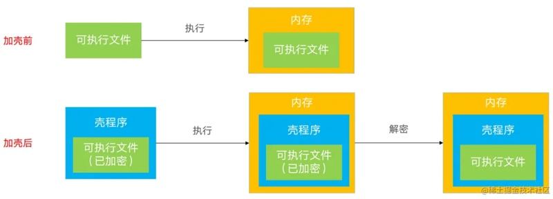
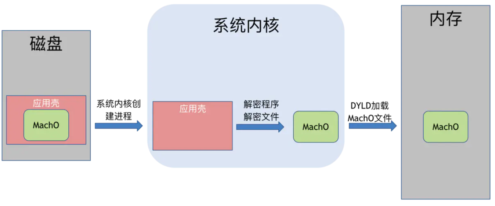

# 砸壳ipa概览

## 什么是壳？

`壳`，在安全和逆向领域，泛指：用技术手段，给原程序额外加上一层保护程序

### 什么是iOS的app的壳？

iOS中的app，发布渠道一般都是`App Store`。

从`App Store`下载的APP全都是经过苹果加密过的`ipa`包。

而Apple会为了安全，给app加密(使用Apple ID相关的对称加密算法)，这个过程俗称为：`加壳`，就像给app外部上加了一层壳

而加密后的`ipa`包，是无法继续后续的逆向过程的

* 后续的典型的逆向过程是
  * 用`IDA`/`Hooper`等去`反编译`
  * 用`class-dump`等去`导出头文件`
    * 说明
      * `class-dump`直接去导出，未砸壳的，`App Store`上的二进制的话
        * 只能导出`CDStructures.h`这个空的头文件，无法得到想要的各种类的头文件
  * 对砸壳后的ipa，去用`MonkeyDev`动态调试
  * 等等

## 什么是iOS的砸壳 + 如何砸壳？

想要破解分析iOS的app之前，需要`把这层壳砸破`=`砸壳`=`脱壳`。

* 砸壳有两种机制
  * 静态砸壳：使用已知的解密方法对软件进行解密叫静态砸壳，静态砸壳难度大，需要知道其软件的加密算法才能对其解密
    * 现在没有这种工具
  * 动态砸壳
    * 现在绝大多数工具都是用此方式

如何（动态）砸壳呢？就要先了解app运行机制：app程序运行起来都会直接在内存解密出原始代码

可以在越狱的设备里面通过内存`dump`方式提取解密后的程序，这种解密过程，也就是给app去壳的过程，又称为`砸壳`=`破壳`

* 额外说明
  * 解密之后还需要手动恢复`Mach-O`头信息才能运行
  * 由于高版本非完美越狱里面，都没有删掉签名验证
    * 所以直接运行都会出现`killed 9`
      * 需要手动签名之后才能使用

## 砸壳的前提

* 确保iOS设备（iPhone等）已越狱
  * 详见：
    * [iOS逆向开发：iPhone越狱](http://book.crifan.org/books/ios_re_iphone_jailbreak/website)
